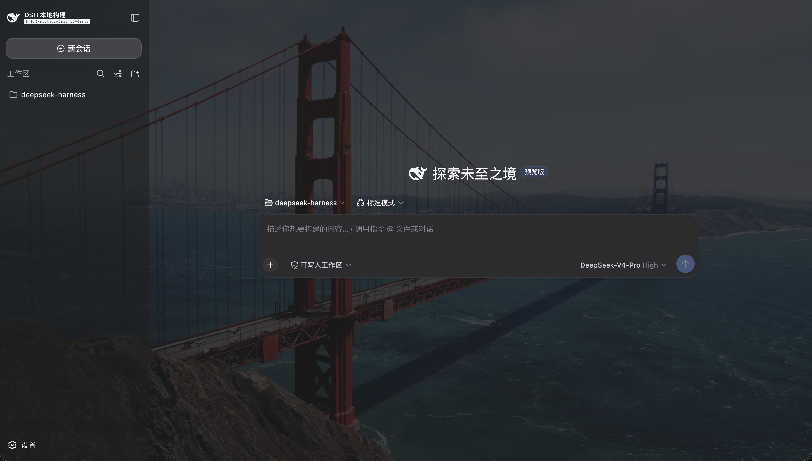

# @imcp-pro/dsh-client-background

[English](README.md) | 中文

[](LICENSE)

一个 [dsh](https://github.com/deepseek-ai/deepseek-harness) Web 客户端 bundle，用随机轮换的 [Unsplash](https://unsplash.com) 壁纸替换基础背景，并通过半透明表面透出。



## 特性

- **100 张精选壁纸**，按可配置的间隔轮换。
- **运行时开关** —— 无需卸载即可关闭背景效果。
- **客户端更新检查** —— 轮询 GitHub 检查新 commit，并给出准确的更新命令。
- **零框架耦合** —— 视觉效果只使用浏览器全局对象（`document`、`Image`、`setInterval`）。

## 环境要求

- 一个 dsh `web` profile（`dsh --profile web`，即 `dsh web`），带 `web-app` bundle。
- 一个暴露基础主题 token `--dsw-alias-bg-base` / `--dsw-specific-sidebar-fill`、切换 `body[data-ds-dark-theme]` 暗色模式属性、并提供「插件」设置面板的 dsh 构建。

## 主题

效果会适配 dsh 的当前主题——浅色模式下是半透明白色表面、深色模式下是半透明深色表面，自动跟随主题（默认跟随系统）。**推荐使用深色模式**：照片呈现为有氛围感的深色背景。浅色模式下照片透过白色遮罩并带轻微暗化，观感更含蓄。

## 安装

### 从 GitHub 安装

```sh
dsh plugin --profile web add github:imcp-pro/dsh-client-background
```

插件的 `prepare` 脚本会在安装时构建 `lib/`（它没有被提交进仓库），而 pnpm ≥ 10 默认拦截 git 依赖的构建脚本、需要先加入白名单。所以第一次运行可能会报 `ERR_PNPM_GIT_DEP_PREPARE_NOT_ALLOWED`——这是预期现象，按以下步骤解决：

1. 复制报错里 **“For example”** 打印出的准确白名单 key：
   `@imcp-pro/dsh-client-background@https://codeload.github.com/…/tar.gz/<commit>`。
2. 把它粘到 web profile 的 `pnpm-workspace.yaml` 里的 `allowBuilds` 下
   （默认路径 `~/.dsh/profiles/web/pnpm-workspace.yaml`），然后重跑同一条命令。

```yaml
# ~/.dsh/profiles/web/pnpm-workspace.yaml
allowBuilds:
  "@imcp-pro/dsh-client-background@https://codeload.github.com/imcp-pro/dsh-client-background/tar.gz/<commit>": true
```

> **注意：** key 是绑定 commit 的——仓库每有一个新 commit，`<commit>` 就会变，所以一定要抄当前报错里的 key。同时务必保留 codeload 的 tar.gz 形式（`https://codeload.github.com/…/tar.gz/<commit>`），不要写成 `git+https://` 或 `git+ssh://`。

### 从 agent 里安装（dsh / Claude Code / OpenCode）

把下面这段 prompt 贴给你的 agent，它会替你安装插件并处理好白名单这一步：

```text
给 web profile 安装 dsh 背景插件：

    dsh plugin --profile web add github:imcp-pro/dsh-client-background

如果命令报 `ERR_PNPM_GIT_DEP_PREPARE_NOT_ALLOWED`（或出现一条提到 `allowBuilds`
的 `dsh:` 提示），就把报错里打印的
`@imcp-pro/dsh-client-background@https://codeload.github.com/.../tar.gz/<commit>`
这行 key 原样复制，加到 `~/.dsh/profiles/web/pnpm-workspace.yaml` 的
`allowBuilds` 下面，然后重跑同一条命令。之后确认插件出现在
`~/.dsh/profiles/web/package.json` 的 `dependencies` 里，报告安装是否成功，
并提醒用户重启 `dsh web` 以加载插件（不要自己重启）。
```

### 从本地 checkout 安装

```sh
npm run build
dsh plugin --profile web add .
```

然后重启 `dsh web`；背景即会出现，并在重启后保持。

## 配置

打开 **设置 → 插件 → 插件列表**，展开 **全局插件** 下的 **壁纸背景**：

| 字段 | 默认值 | 说明 |
| --- | --- | --- |
| 启用背景 | 开 | 运行时关闭开关；插件仍保持安装 |
| 切换间隔（秒） | 20 | 背景图每隔多久自动切换一次 |
| 自动检查更新 | 关 | 定期检查 GitHub 仓库是否有新版本 |
| 检查间隔（秒） | 21600 | 两次更新检查之间的间隔 |

修改先暂存，**保存** 后生效，**放弃修改** 则丢弃。检测到新 commit 后，条目会显示要运行的更新命令（运行后重启）。

## 开发

```sh
npm install
npm run build   # esbuild 打包 + tsc 生成声明 → lib/
npm test        # vitest（jsdom）
```

`tsconfig.json` 把 `@deepseek-ai/dsh-*` 的类型导入映射到同级目录的 deepseek-harness 源码 checkout（其 `lib/types`），因为当前已发布的 dsh 包早于插件所针对的源码 API。构建前请把 `paths` 指向你自己的 checkout。

## 发布

```sh
npm publish    # `prepare` 会执行构建；发布 lib/ + cordis.patch.yml
```

本包发布 `lib/` 和 `cordis.patch.yml`。它声明 `dsh.bundle.patch`（让 `dsh plugin add` 注册该层）、`dsh.client`（让 client-modules 宿主提供浏览器半侧），以及由 Host 半侧注册的 `client-background` settings namespace。

## 说明

- **即时切换，无淡入淡出** —— 预加载消除了加载闪烁，但图片仍是一步切换。
- **`background-attachment: fixed` 在 iOS Safari 上被忽略** —— 在那里图片会随页面滚动。
- **更新检查在客户端进行** —— 浏览器轮询 GitHub 默认分支，把它的 commit 和构建时烙进 bundle 的 commit 比较，因此绝不会改动正在运行的安装。

## 许可证

[MIT](LICENSE)
